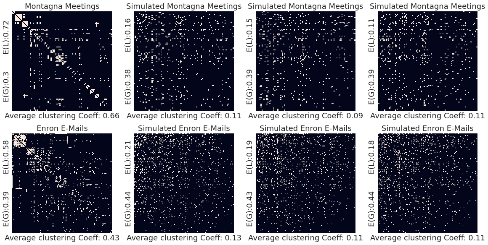

# CRIME NETWORK ANALYSIS



This has been made as the final project of ITU - Graph Theory course. This repository provides an experimental analysis script for following data:

> https://networkrepository.com/ia-enron-only.php </br>
> https://zenodo.org/record/3938818

The analysis reproduces the graphs with the Maslov-Sneppen algorithm while preserving certain conditions. It compares the produced synthetic graphs with the original graphs according to the "Local Efficiency", "Global Efficiency" and "Clustering Coefficient" criteria. Benchmark results are evaluated and interpreted.

## Running the Analysis

You can run the notebook file to execute full analysis that the paper contains.

# Please cite the original paper when using the content:

```latex
@misc{ozturk2021_crime,
  author = {Ozturk, Anil and Gunduz, Salih and Kilickap, Sarp and Ozer, Caner},
  title = {Clustering Analysis of the Criminal Networks},
  year = {2021},
  publisher = {GitHub},
  journal = {GitHub repository},
  howpublished = {\url{https://github.com/nlztrk/crime_networks_analysis}},
}
```